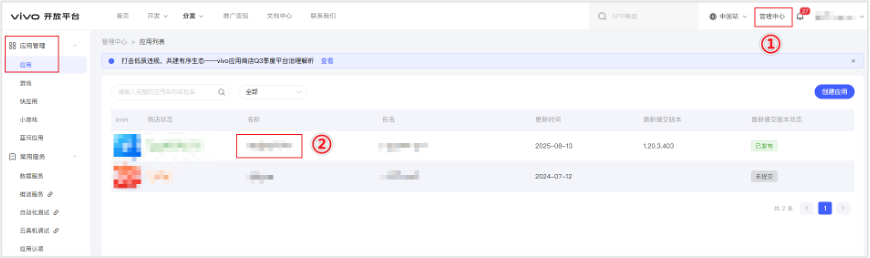
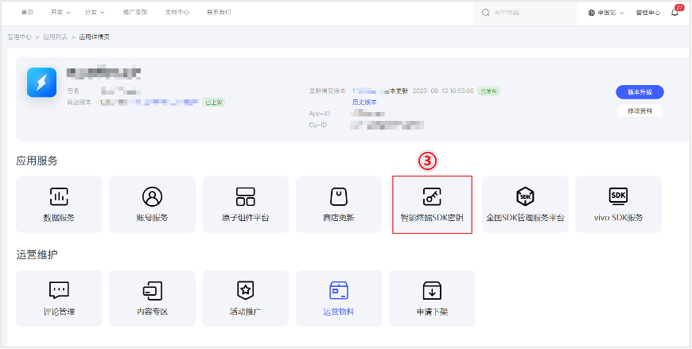
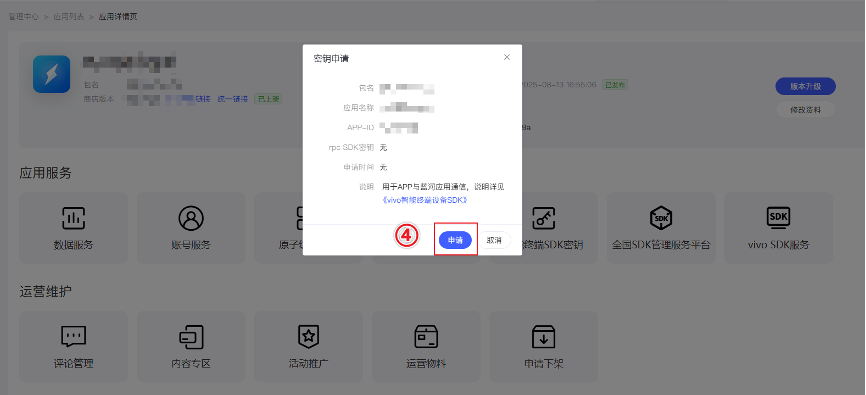
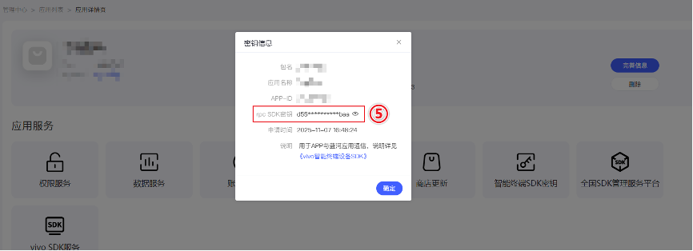

> 来源：[https://developers-watch.vivo.com.cn/api/connect/development-guidance/rpc-sdk-guidance/](https://developers-watch.vivo.com.cn/api/connect/development-guidance/rpc-sdk-guidance/)
> 更新时间：2025/12/01 19:33:15

# vivo 智能终端设备 SDK

## 开发准备，申请 appid

#### 1. 申请 app 开发者接入，接入地址：[vivo 开放平台](https://dev.vivo.com.cn/)，已有账号则无需申请，直接登录

#### 2. 申请账号后，注册对应的 app，取到 appid

## SDK 集成

```ts
implementation files('libs/device-rpc.aar')
```

## 初始化

```ts
 // 在 app 恰当的时候初始化，如果需要拉起并发送到通知，建议放 application 里面。
 DeviceRpcManager.getInstance().init(getApplicationContext(), String encryStr,InitCallBack initCallBack);
```

#### encryStr（智能终端SDK密钥）申请路径:

登录vivo开放平台 --> 进入管理中心 --> 进入应用列表 --> 点击对应应用名称，进入应用详情页 --> 点击“智能终端SDK密钥”图标--> 点击弹窗的“申请”，会自动生成密钥 --> 点击眼睛按钮即可查看完整密钥；









#### InitCallBack:鉴权结果回调

#### manifest 中添加 meta 数据，固定格式和名称，用于设备查询 app 功能信息

```html
<meta-data android:name="health.device.manager.version" android:value="1" />
<meta-data android:name="appid" android:value="开发平台申请的appid" />
```

## 三方 APP 协议参考设计

三方 App 除了获取“运动健康功能版本号”，“读取设备对应功能版本号”外，通常需要使用接口<给设备发送 Request 数据>跟手机交换数据，为了区分不同 Request 数据类型，建议使用如下 Json 格式

```json
{
     "type":"type_xxxx"
     "data":{}
}
```

#### 对应的 Response 数据类型，建议使用如下 Json 格式：

```json
{
     "code"：0
     "result":{}
}
```

#### 其中

- type 指定数据类型，不同的业务对应不同的类型，用于对端区分数据，作相应处理
- data 数据，不同业务有不同的数据
- code 对端的业务执行结果
- result 结果依赖不同的 type 而不同
## SDK 下载

[vivo 智能终端设备 SDK](https://h5.vivo.com.cn/health/rpcsdk/new/device-rpc.aar)

## API 参考

[手机侧](../../mobile-side/index.md)

## 隐私政策

[隐私政策](../privacy-policy/index.md)
