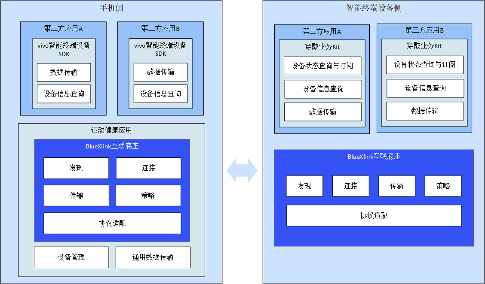

> 来源：[https://developers-watch.vivo.com.cn/api/connect/introduce/](https://developers-watch.vivo.com.cn/api/connect/introduce/)
> 更新时间：2023/11/02 15:33:26

# 概述

基于开放兼容的 BlueXlink 互联底座，可以实现不同设备间的能力互补，为用户提供一致的交互体验。

BlueXlink 互联底座实现了设备发现，连接，组网，安全认证，协议兼容等复杂工作，开发者只需要调用简单的 API，就可实现设备互联功能的开发。

另外，我们提供了支持多种开发语言的，多套 SDK 支持不同设备间的互联。当前向手机及 vivo 智能终端设备第三方应用开发者开放 BlueXlink 互联能力。

基于 BlueXlink 互联底座提供的设备发现、连接、组网能力及运动健康应用，开发者可以无感地实现手机与 vivo 智能终端设备间的发现与连接，基于 BlueXlink 互联底座提供的数据交互能力，开发者可简单地实现手机侧应用及 vivo 智能终端设备侧应用间的消息通知发送、数据文件传输、设备状态获取等能力。

手机及 vivo 智能终端设备间的互联及数据共享为消费者提供更丰富的场景与体验，同时为第三方应用提供了更多的机会。

## 支持的设备

| 设备 | 要求 |
| --- | --- |
| 手机 | 安装 vivo 运动健康应用 |
| vivo 智能终端设备 | vivo WATCH3 |

## 开放能力

| 能力 | 手机侧应用 | vivo 智能终端设备侧应用 |
| --- | --- | --- |
| 设备发现 | √ | √ |
| 设备连接 | √ | √ |
| 设备信息查询 | √ | √ |
| 设备状态查询及订阅 | √ | √ |
| 数据传输（文件/字节流） | √ | √ |

## 技术架构

## 手机侧

手机侧运动健康应用集成互联底座能力，我们针对手机侧第三方应用提供 vivo 智能终端设备 SDK。  基于 vivo 智能终端设备 SDK，第三方应用可以实现与 vivo 运动健康应用之间的数据通信和交互，以及与 vivo 智能终端设备侧第三方应用、vivo 智能终端设备之间的业务数据通信能力。 

## vivo 智能终端设备侧

vivo 智能终端设备集成互联底座能力，我们针对 vivo 智能终端设备侧第三方应用提供穿戴业务 Kit。  穿戴业务 Kit 为第三方应用提供设备状态查询与订阅、设备信息查询及数据传输能力的接口，设备发现及连接细节由互联底座完成，第三方应用开发者无需关心。 

## 开发指导

[开发指导](../development-guidance/rpc-sdk-guidance/index.md)

## API 参考

[API 参考](../brief-introduction/index.md)
