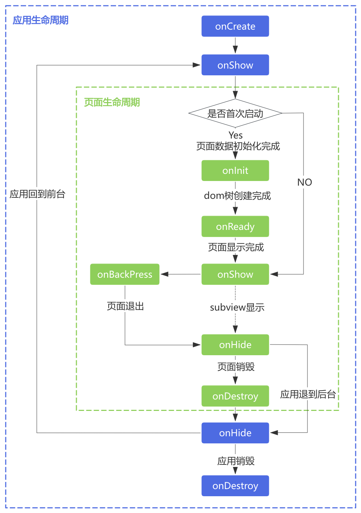

> 来源：[https://developers-watch.vivo.com.cn/api/extend/lifecycle/](https://developers-watch.vivo.com.cn/api/extend/lifecycle/)
> 更新时间：2025/07/03 13:00:36

# 生命周期

> 了解应用/页面/自定义组件的生命周期与状态



## 应用生命周期

### onCreate

监听应用创建，应用创建时调用。

**参数**

无

### onDestroy

监听应用销毁，应用销毁时调用。

**参数**

无

### onShow

应用显示在前台时调用。

**参数**

无

### onHide

应用退到后台时调用。

**参数**

无

## 页面生命周期

### onInit

监听页面初始化。当页面完成初始化时调用，只触发一次

**参数**

无

### onReady

监听页面创建完成。当页面完成创建可以显示时触发，只触发一次

**参数**

无

### onShow

onShow 是一个页面生命周期函数，用于监听页面显示的事件。当一个页面被打开或从后台切换到前台时(当应用处于后台时打开页面但页面没有在前台显示时 onShow 方法不会被触发)，onShow 方法会被触发。

**参数**

无

### onHide

onHide 是一个页面生命周期函数，用于监听页面隐藏的事件。当一个页面被切换到后台或关闭时(当应用处于后台时页面被关闭 onHide 方法不会被触发)，onHide 方法会被触发。

**参数**

无

### onDestroy

监听页面退出。当页面跳转离开（退出页面栈）时触发

**参数**

无

### onBackPress

监听返回动作。当用户执行返回操作时触发。只有当前页面配置了 followHand : disable，该接口才生效。

**参数**

无

**返回值**

| 类型 | 描述 |
| --- | --- |
| boolean | 返回 true 表示页面自己处理返回逻辑，返回 false 表示使用默认的返回逻辑，不返回值会作为 false 处理； 注意：该函数不支持声明为异步函数（即：使用`async`标识），因为返回值代表界面要立即响应用户操作； |

### onRefresh

监听页面重新打开。onRefresh 在 onShow 之前执行。

当页面在 manifest 中 launchMode 标识为'singleTask'时，仅会存在一个目标页面实例，用户多次打开目标页面时触发此函数。

该回调中参数为重新打开该页面时携带的参数。

详见[页面启动模式](../../../reference/extend/launch-mode/index.md)

**参数**

| 参数名 | 类型 | 描述 |
| --- | --- | --- |
| query | Object | 通过 deeplink、router.push 等接口传入的 uri 中 query 解析成的对象，或者 router.push 等接口传入的 params 对象 |

### onKey

监听按键响应。当按键被触发时回调

**参数**

| 参数名 | 类型 | 描述 |
| --- | --- | --- |
| event | Object | 被触发的按键事件 |

**event 参数**

| 参数名 | 类型 | 描述 |
| --- | --- | --- |
| keyCode | Number | 按下的键位，0：下键(电源键)，1：上键 |
| keyAction | Number | 按下或弹起的动作 0：按下 1：短按弹起 2：长按弹起 |
| repeatCount | Number | 连续按的次数，按键在长按的时候，会连续产生多个按下事件，这个时候第一个按下事件的 repeatCount 为 0，之后的按下事件 repeatCount 会递增。 |

**示例代码：**

```ts
onKey(event) {
  console.log(`key pressed! ${JSON.stringify(event)}`);
  console.info(`触发页面生命周期 onKey`)
}
```

### onConfigurationChanged

监听系统语言改变

**参数**

| 参数名 | 类型 | 描述 |
| --- | --- | --- |
| event | Object | 应用配置发生变化的事件 |

**event 参数：**

| 参数名 | 类型 | 描述 |
| --- | --- | --- |
| type | String | 应用配置发生变化的原因类型，支持的 type 值如下所示 |

**event 中`type` 现在支持的参数值如下：**

| 参数值 | 描述 |
| --- | --- |
| locale | 应用语言、地区变化而发生改变 |

**示例代码：**

```javascript
onConfigurationChanged(evt) {
  if (event && event.type && event.type === 'locale') {
    console.log('locale or language changed!')
  }
}
```

### onPalmOver

监听手掌覆盖事件

**参数**

无

**返回值**

`true` 表示不将事件继续传递给 launcher，其他值或者不返回都会将事件继续传递给 launcher。

**示例代码：**

```javascript
onPalmOver(evt) {
  console.info(`大手掌事件 onPalmOver`)
  return true;
}
```

## 自定义组件生命周期

自定义组件，指的是通过 import 标签引入的 ViewModel 组件

### onInit

监听初始化，当数据驱动化完成时触发

**参数**

无

### onReady

监听模板创建完成，当模板创建完成时触发

**参数**

无

### onDestroy

监听组件销毁，当销毁时触发

**参数**

无
