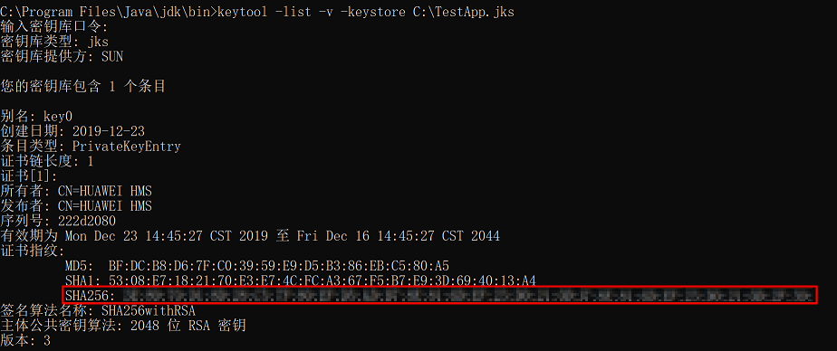
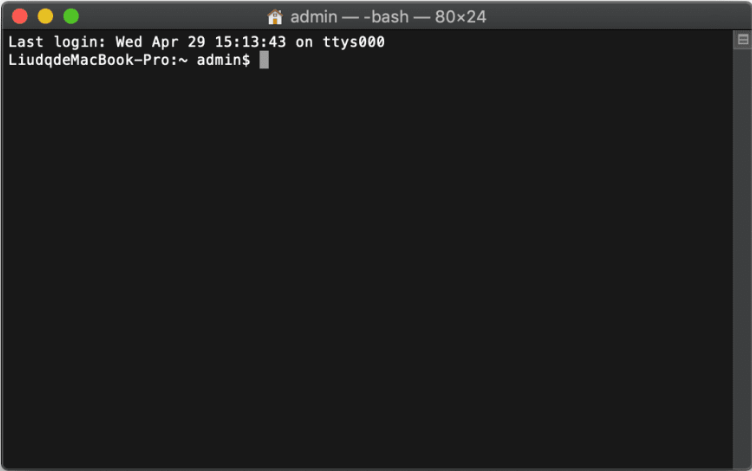
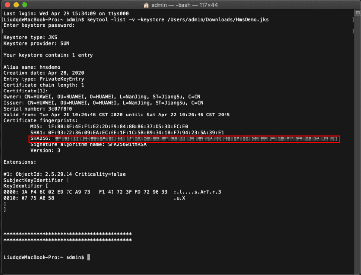

> 来源：[https://developers-watch.vivo.com.cn/api/system/generatecertificatethumbprint/](https://developers-watch.vivo.com.cn/api/system/generatecertificatethumbprint/)
> 更新时间：2024/01/10 16:04:30

# 生成签名证书指纹

开发者通过**JDK**的**Keytool**工具以及签名文件，导出**SHA256**指纹。

## windows

1. 执行 CMD 命令打开命令行工具，执行 cd 命令进入 keytool.exe 所在的目录（以下样例为 JDK 安装在 C 盘的 Program Files 目录）。
```bash
  cd C:\Program Files\Java\jdk\bin
```

1. 执行命令 `keytool -list -v -keystore \<keystore-file\>`，按命令行提示进行操作。`\<keystore-file\>`为应用签名证书的完整路径。例如：
```bash
  keytool -list -v -keystore C:\TestApp.jks
```

1. 根据结果获取对应的 SHA256 指纹。


## macOS

1. 打开 Terminal 终端。


1. 执行命令 `keytool -list -v -keystore \<keystore-file\>`，按命令行提示进行操作。`\<keystore-file\>`为应用签名证书的完整路径。例如：
```bash
  keytool -list -v -keystore /Users/admin/Downloads/HmsDemo.jks
```

1. 根据结果获取对应的 SHA256 指纹。

