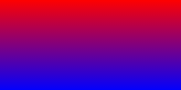
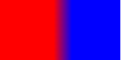

> 来源：[https://developers-watch.vivo.com.cn/component/common/gradient-styles/](https://developers-watch.vivo.com.cn/component/common/gradient-styles/)
> 更新时间：2023/10/20 10:02:06

# 渐变样式

渐变 (gradients) 可以在两个或多个指定的颜色之间显示平稳的过渡，用法与 CSS 渐变一致。

当前框架支持以下渐变效果：

- 线性渐变 (linear-gradient)
- 重复线性渐变 (repeating-linear-gradient)
## 线性渐变 / 重复线性渐变

创建一个线性渐变，需要定义两类数据：1) 过渡方向；2) 过渡颜色，因此需要指定至少两种颜色。

1. 过渡方向：通过`direction`或者`angle`两种形式指定
2. 过渡颜色：支持方式：`#FF0000`、`#F00`
- direction: 方向渐变
```css
background: linear-gradient(direction, color-stop1, color-stop2, ...);
background: repeating-linear-gradient(direction, color-stop1, color-stop2, ...);
```

### 参数

| 名称 | 类型 | 默认值 | 必填 | 描述 |
| --- | --- | --- | --- | --- |
| direction | `to` `<side-or-corner>`<br>`<side-or-corner>` = [`left` \| `right`] \|\| [`top` \| `bottom`] | `to bottom` (从上到下渐变) | 否 | 例如：`to right` (从左向右渐变) |
| - | - | - | - | - |
| color-stop | `<color>` [`<length>`\|`<percentage>`] | - | 是 | 从起点到`stop`的区域显示的背景色为`color` |

### 示例

```css
#gradient {
  height: 100px;
  width: 200px;
}
```

```css
/* 从顶部开始渐变。起点是红色，慢慢过渡到蓝色 */
background: linear-gradient(#f00, #00f);
```



```css
/* 从左向右渐变，在距离左边90px和距离左边120px (200*0.6) 之间30px宽度形成渐变*/
background: linear-gradient(to right, #f00 90px, #00f 60%);
```


