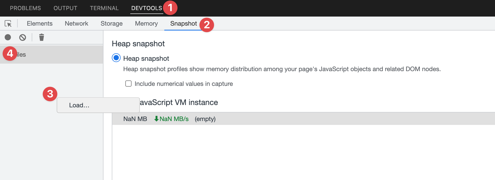
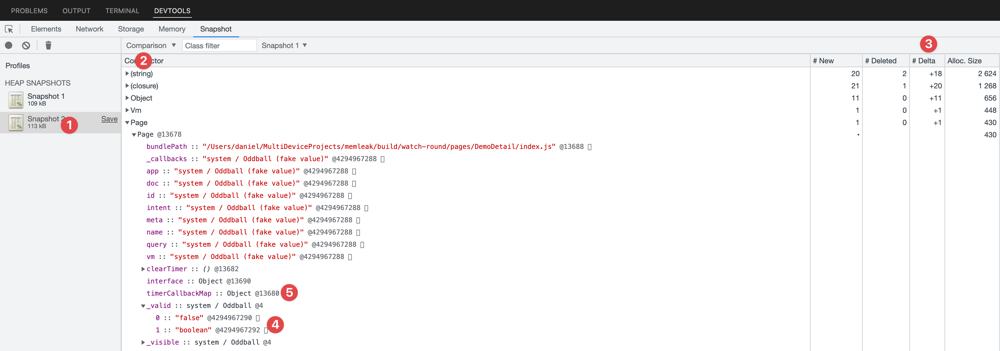

> 来源：[https://developers-watch.vivo.com.cn/reference/perf-guide/perf-memory-leak/](https://developers-watch.vivo.com.cn/reference/perf-guide/perf-memory-leak/)
> 更新时间：2025/05/20 10:54:23

# js 内存泄漏排查

在需要排查的场景先后进行两次 dump, 比如排查页面泄漏，在进入页面前 dump 一次，进入页面退出后再 dump 一次

导出泄漏可以分为两种情况

- 如果应用不需要底层能力支撑 比如不需要 `blueos.multimedia.audio`这些底层能力，可以直接在 BlueOS Studio 测试，在下图场景前后分别点击 `位置 4` 进行 dump
- 如果应用需要底层能力支持
​ 先安装具有能 dump js heap 的固件， `dump_js_heap /sdcard` , 然后拷贝到主机，来到 BlueOS Studio 的面板进行 `位置3`加载

下图为 js heap 分析和导出的在 BlueOS Studio 中位置`Devtool->Snapshot->Profile`



## 分析泄漏

比如我们构造一个常见的泄漏，event 订阅了但没有取消 （npm 类库 [[eventEmitter3]](https://www.npmjs.com/package/eventemitter3)有类似的问题）

```js
  import event from '@blueos.app.event'
  onReady() {
    const that = this
    const evtId = event.subscribe({
      eventName: 'myEventName',
      callback: function MyEvent(res) {
        console.log(res.params)
        that.hello()
      },
    })
```

进入退出页面后，导出两份 snapshot，选中第二份 snapshot (标号 1), 在 `标号2` 处切换到 `comparison`试图，然后重点关注`标号3`的 Delta 部分， 增量即为泄漏

可以重点关注以下对象

- App, 每个应用有一个，如果新增，代表应用泄漏
- Page，对应一个页面或者表盘，有新增代表相关泄漏
- Vm，每个 Page 和自定义组件对应一个 Vm，List 的每个 Item 不触发 JIT 的情况也会有
- 自己 Page 中特有的对象和函数


### 其他说明

- 标号 4 `_valid` 可以 Page 是否泄漏
- 标号 5 内容不为空（有右箭头），说明有 timer 泄漏
这个格式其实是 chrome 的 devtools 的标准格式
