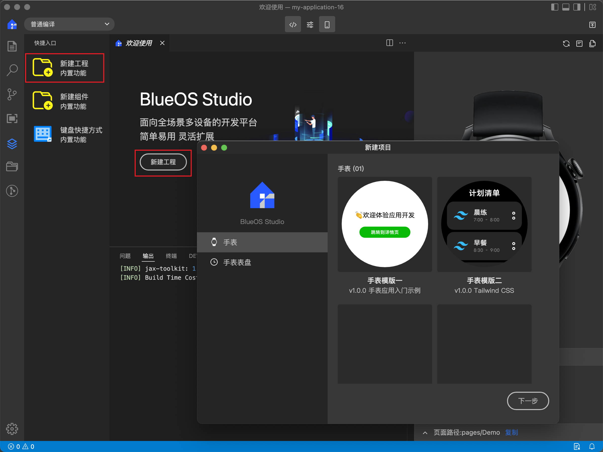
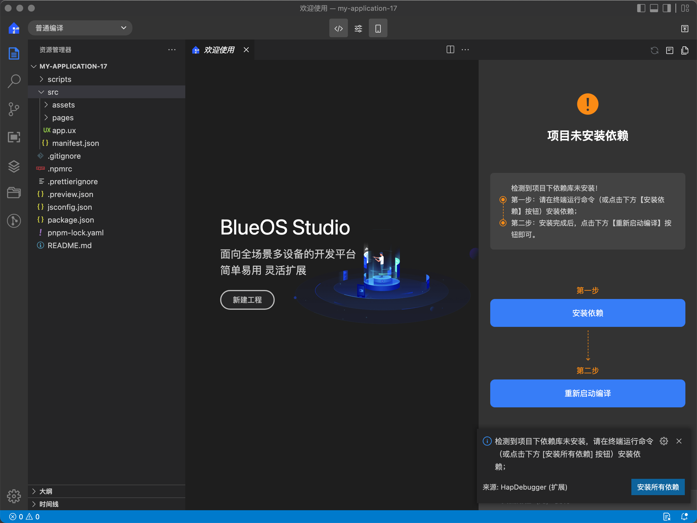
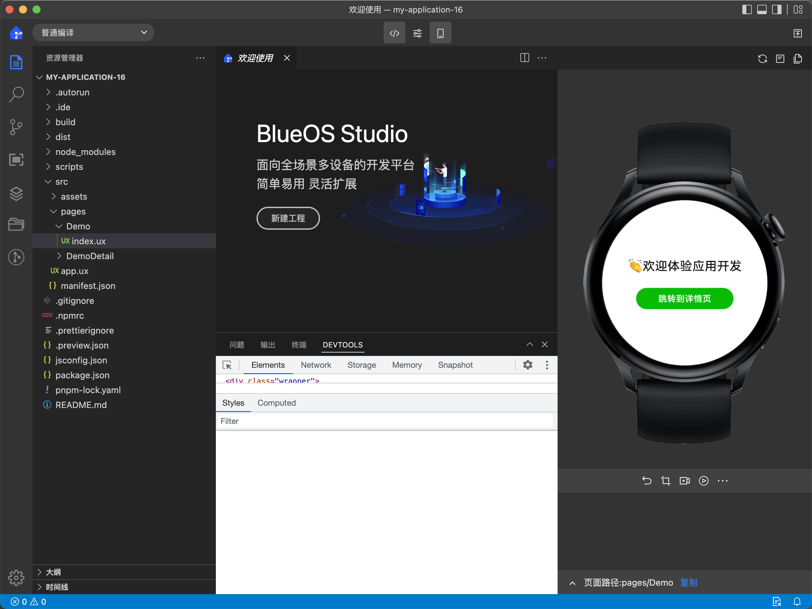
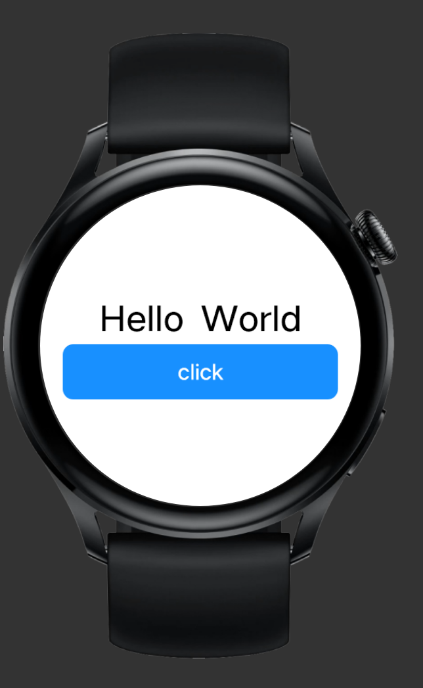
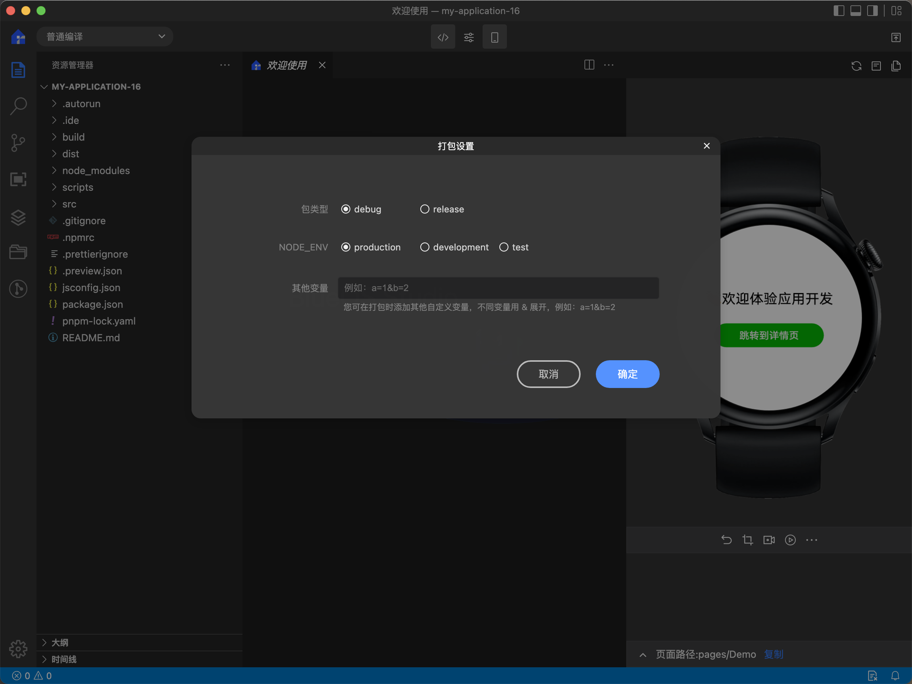
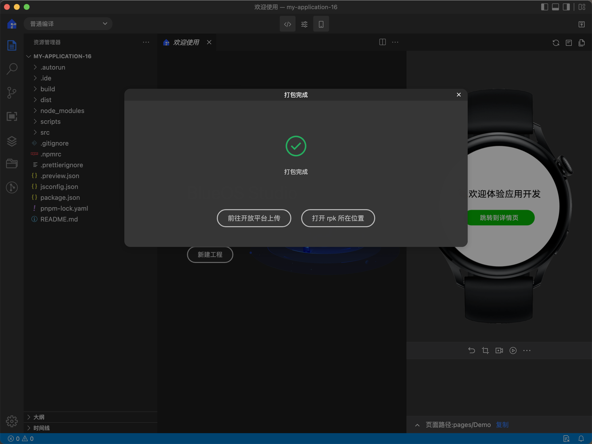

> 来源：[https://developers-watch.vivo.com.cn/reference/quickstart/quick-start/](https://developers-watch.vivo.com.cn/reference/quickstart/quick-start/)
> 更新时间：2025/10/09 11:25:10

# 构建首个蓝河应用

> 本文将从开发工具、新建项目、安装依赖、调试项目、打包等方面入手，让您学习后，可以构建首个蓝河应用。

## 开发

开发者可以使用 BlueOS Studio 开发、调试和打包蓝河应用。以下所有的操作均在 BlueOS Studio 中完成，开发者可以[点击链接进入工具下载页面](https://studio.blueos.com.cn/install)，先安装 BlueOS Studio 。

### 一、新建项目

新建方法如下：

1. 点击`欢迎页`「**新建工程**」、或`菜单栏`「**新建工程」**、或`快捷入口`处「**新建工程**」，打开新建工程界面；
2. 点击「**下一步**」 ，填写项目名称、项目路径、应用名称和应用包名，点击「**完成**」，BlueOS Studio 会在项目路径下，新建项目并自动打开。


### 二、安装依赖

- 准备工作：安装并配置 [Node](https://nodejs.org/en) 环境。
- 在 BlueOS Studio，我们提供了方便的方式来安装依赖，如下图示，只要点击「**安装依赖**」按钮，即可。
- 安装完毕之后，点击「**重新启动编译**」按钮，即能重新编译；之后编写代码，就能在预览区实时查看效果，而无需其他任何操作。


### 三、文件组织说明

```bash
├── scripts                   工具脚本文件
├── src
│   ├── assets                公用资源
│   │   ├── images            图片资源
│   │   └── styles            应用样式
│   ├── pages                 页面目录
│   │   ├── Demo              应用首页
│   │   └── DemoDetail        应用详情页
│   ├── app.ux                入口文件。
│   └── manifest.json         项目配置文件，配置应用图标、页面路由等
└── jsconfig.json             js 配置文件，用于语法校验
└── package.json              定义项目需要的各种模块及配置信息
```

### 四、开发调试

- BlueOS Studio 支持实时预览功能，开发者只需保存修改后的代码，即可在右侧模拟器实时预览修改效果。你可以通过 BlueOS Studio 下方提供的 DevTools 面板，进行调试样式、查看请求等操作。


<br><br>

开发者可以跟着下面的步骤，一步步完成第一个蓝河应用的构建。

#### 1.构建 UI

安装依赖后，即可打开 "src/pages/Demo/index.ux"文件，设置 `<template>` 标签内容，来构建页面 UI。`<template>` 标签示例如下：

```html
<template>
  <div class="wrapper">
    <text>Hello World</text>
  </div>
</template>
```

#### 2.设置页面样式

在"src/pages/Demo/index.ux"文件中，新增`<style>`标签，对页面中文本、按钮等 UI 设置宽高、字体大小、间距等样式。`<style>`标签示例如下：

```html
<style>
  .wrapper {
    flex-direction: column;
    align-items: center;
    justify-content: center;
  }

  text {
    font-size: 50px;
    lines: 2;
  }
</style>
```

#### 3.处理业务逻辑

在"src/pages/Demo/index.ux"文件中，新增`<script>`标签处理业务逻辑。在初始`<template>`的基础上，我们添加一个 button 类型的 input 组件，作为按钮响应用户点击，从而实现业务逻辑。

```html
<script>
  export default {
    data: {},

    buttonClick(event) {
      console.log('click event fired')
    },
  }
</script>

<template>
  <div class="flex-col items-center p-20">
    <text>Hello World</text>
    <input type="button" class="w-[400px] h-[80px] text-white bg-[#1890ff] rounded-[15px] mt-10" value="click" onclick="buttonClick" />
  </div>
</template>

<style>
@tailwind utilities;
</style>
```

#### 4.在右侧模拟器实时预览。第一个页面效果如下图所示：



### 五、打包

开发完成后，可以使用 BlueOS Studio 打包出应用 rpk 包，步骤如下：

1. 点击顶部工具栏的「**打包** 」按钮，可以选择包类型和环境变量，包类型可选 release 和 debug，release 包需要填写信息生成签名后，再行打包；环境变量可选 production、development 和 test，根据环境不同可调用不同的后台接口而不用手动修改代码；
2. 打包成功之后，会在 dist 目录下生成相应的 rpk 包，可以「打开 rpk 所在位置」；
3. 打包成功之后，可以点击前往开放平台上传 rpk 包。


<br> <br>


