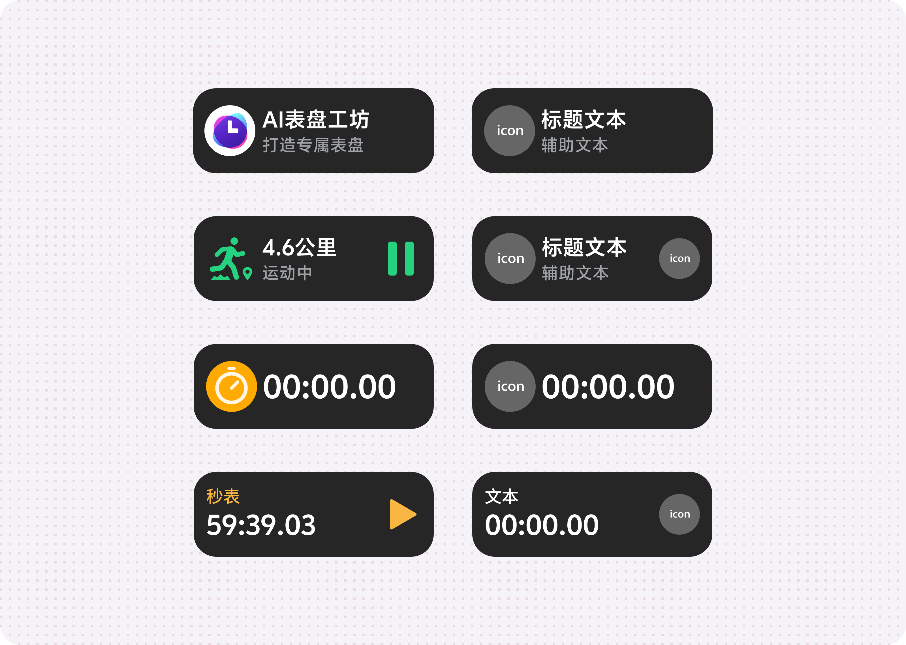
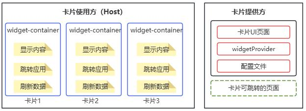
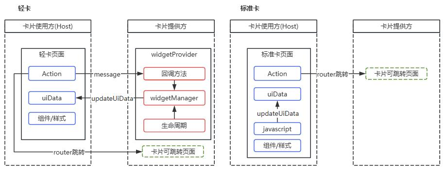

> 来源：[https://developers-watch.vivo.com.cn/reference/widget/overview/](https://developers-watch.vivo.com.cn/reference/widget/overview/)
> 更新时间：2025/10/09 11:25:10

# 概述

本节介绍卡片的定义、分类、模块架构和运行原理。

## 什么是卡片

卡片是一种轻量的应用形态。它可以嵌入到各类场景应用的页面中（如负一屏，桌面，全搜，锁屏，浏览器，语音助手等），为用户提供快速、直观且高度关联的服务体验。通过精准和便捷地展示信息或功能，卡片不仅提高了用户获取服务的效率，也为应用带来了更多曝光机会和用户参与度。

## 卡片分类

蓝河系统卡片分为**标准卡**和**轻卡**，不同的卡片的特点和使用场景不一样，下面是两种卡片的对比说明。

| 分类 | 标准卡 | 轻卡 |
| --- | --- | --- |
| 介绍 | 功能完备，具备完整数据处理及逻辑闭环 | 轻量，依赖外部数据和逻辑支持 |
| 特点 | 1.有 JS 代码 2.支持 UI 组件 3.支持 JS 组件动画 4.不支持外部提供数据 | 1. 无 JS 代码 2. 支持 UI 组件 3.不支持 JS 组件动画 4.支持外部提供数据 |
| 适用场景 | UI 和交互上需求更复杂的卡片 | 由外部提供数据，动效和交互不复杂的场景 |

## 模块架构

**卡片提供方：** 包含卡片的应用，提供卡片的显示内容、布局以及控件点击处理逻辑

- **卡片页面：** 卡片 UI 模块，包含页面组件、布局、事件等显示和交互信息
- **widgetProvider:** 处理卡片的生命周期与回调方法，给卡片页面提供和更新数据。不同类型的卡片此模块有所区别：轻卡有此模块，标准卡中无此模块。
- **配置文件：** 配置卡片刷新时间、尺寸、名称等信息
- **卡片可跳转的页面：** 用户点击卡片内容可以拉起这些页面，此模块非必须。
**卡片使用方(Host)：** 如 launcher 应用的桌面页面，他是卡片的宿主应用，可以显示卡片内容，控制卡片展示的位置。

- **widget-container：** 用于渲染卡片的 UI 组件，可以在 Host 应用显示的卡片界面，卡片显示的内容可以交互，也可以刷新。
  - **内容显示：** 显示不同尺寸规格的内容界面，将卡片页面挂在 Host 应用界面的节点上
  - **跳转应用：** 点击卡片可以拉起卡片提供方应用的界面
  - **刷新数据：** 卡片显示的数据内容，可以进行刷新，其中标准卡可以自主刷新，轻卡需要借助 widgetProvider 来完成
## 运行原理

- **widgetProvider**
  - **回调方法：** 由 Action 调起，用于响应 Action。
  - **生命周期：** 卡片的创建、销毁等生命周期
  - **widgetManager：** 用于更新卡片数据，可在生命周期和回调方法中使用
- **卡片页面**
  - **组件/样式：** 用于卡片页面布局
  - **uiData：** UI 数据，可由 widgetProvider 或卡片页面 JS 更新
  - **javascript:**
    - 标准卡：用于执行卡片所有业务逻辑。
  - **Action：** 一个功能概念，可以触发以下操作：
    - 页面跳转：跳转到卡片提供方页面。
    - 事件传递：调起 widgetProvider 的回调方法。
从上也可以得出来**两种卡片类型特点：**

- **标准卡：** 功能完备，具备完整数据处理及逻辑闭环，但是不够轻量
- **轻卡：** 轻量，依赖外部数据和逻辑支持，但是无法执行复杂的 UI 交互
## 存储沙箱

卡片的存储沙箱机制遵守蓝河系统沙箱机制，即：同一包名的应用共享同一个应用存储沙箱。

通常情况下，一个工程下的应用和卡片的应用沙箱存储共享，这意味着：

- 共用存储目录（files/preferences/）
- 共享数据库文件
- 共享 storage 存储的数据
- 共享缓存目录（cache/temp）
由于卡片与主应用共用包名时，可无缝访问主应用存储数据，因此需要注意以下事项：

- 敏感数据保护：应对重要数据进行加密处理，或采用独立包名机制
- 版本管理：需建立主应用与卡片间的数据版本协同更新机制
## 权限

- 权限申请：
  - 标准卡片由卡片应用向用户申请权限
  - 轻卡无 js 逻辑，不存在权限申请
- 权限共享：
  - 同一包名下已授权的权限可共享，可不用重复申请。
