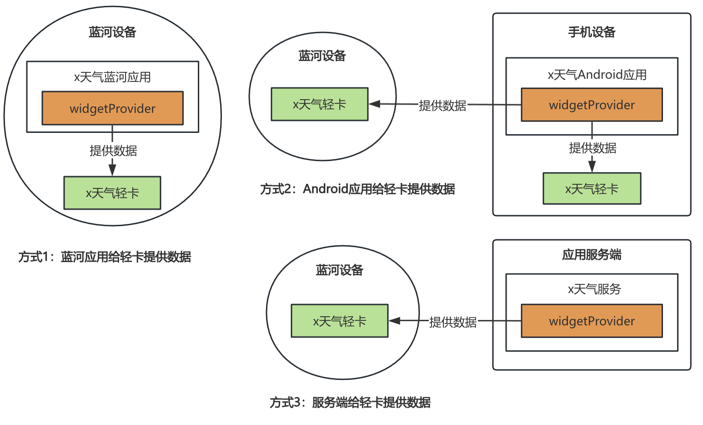
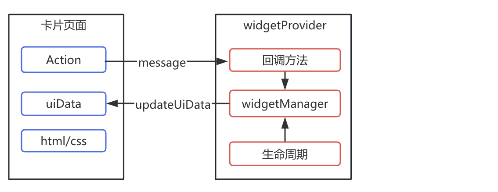

> 来源：[https://developers-watch.vivo.com.cn/reference/widget/widget-provider/](https://developers-watch.vivo.com.cn/reference/widget/widget-provider/)
> 更新时间：2025/10/09 11:25:10

# widgetProvider 开发

本节将介绍 widgetProvider 的核心概念和三种实现方式。鉴于不同平台的开发方式各有差异，开发者可以做在具体文档中查阅。本节重点讲解 widgetProvider 的顶层概念，通过理解这些概念，您将更容易掌握不同实现方式之间的互通性。

## 概述

### widgetProvider 介绍

widgetProvider 是轻卡的核心组成部分，它负责执行轻卡页面的逻辑，并与轻卡页面进行数据传递。

根据数据来源的不同，widgetProvider 有三种不同的实现方式：

| 应用场景 | 实现方式 |
| --- | --- |
| 蓝河应用给轻卡提供数据 | 蓝河应用 |
| Android 手机应用给轻卡提供数据 | Android 应用 |
| 服务端接口通过网络请求给轻卡提供数据 | 服务端 |



### 核心组成与作用



#### 核心组成

widgetProvider 的组成部分为**生命周期、回调方法和 widgetManager**。

- **回调方法：** 响应轻卡页面传递过来的数据。
- **生命周期：** 响应轻卡的创建、销毁等生命周期
- **widgetManager：** 用于更新卡片数据
#### 响应卡片生命周期

widgetProvider 通过下面的生命周期，来执行轻卡的页面的业务逻辑。

- 创建：当卡片在入口被创建时触发
- 刷新：定时或定点条件满足时触发
- 销毁：销毁卡片时触发
- 系统语言变化：监听系统语言改变
**例如：**

```ts
export default {
  onWidgetCreate() {
    console.log('卡片创建')
  },
  onWidgetUpdate() {
    console.log('满足时刷新条件')
  },
  onWidgetDestroy() {
    console.log('销毁卡片')
  },
  onConfigurationChanged() {
    console.log('系统语言改变')
  },
}
```

#### 响应卡片页面自定义事件

widgetProvider 上的 onWidgetEvent 回调可以响应卡片页面发过来的自定义事件和事件数据。

**例如：**

> widgetProvider 接受数据

```ts
export default {
  onWidgetEvent(id, event) {
    console.log('收到卡片页面的事件')
  },
}
```

> 卡片页面发送事件

```html
<text onclick="onTextClick">hello</text>
```

```json
{
  "actions": {
    "onTextClick": {
      "type": "message.md",
      "params": {
        "content": "hello"
      }
    }
  }
}
```

#### 刷新轻卡数据

widgetProvider 还通过接口来刷新 轻卡 UI 页面中的 uiData 数据。

> widgetProvider 发送数据给页面

```ts
import widgetManager from '@blueos.app.widgetManager'
export default {
  // 卡片创建时触发
  onWidgetCreate(id) {
    widgetManager.updateUiData({
      instanceId: id,
      uiData: { cityName: `Shenzhen` },
    })
  },
}
```

> 卡片页面编写

```html
<text>{{cityName}}</text>
```

```json
{
  "uiData": {
    "cityName": ""
  }
}
```

### 权限与限制

**权限申请：** 当运行 widgetProvider 时需要用户授权，权限申请的主体应为 widgetProvider 所在的应用。

**跳转限制：** 为了防止 widgetProvider 随意启动应用并浪费系统资源，widgetProvider 中禁止跳转到其他应用页面。

## 开发实践

### 注册 widgetProvider

在蓝河应用的 manifest.json 中配置如下信息

```json
{
  "widgetProvider": [
    {
      "name": "mymusic",
      "path": "/widgetProvider/index.js"
    }
  ]
}
```

此时对应轻卡需存在配置如下： **注意：需要卡片应用签名和蓝河应用签名一致才可以提供数据**

```json
{
  "router": {
    "widgets": {
      "widget/lite_widget": {
        "providerUri": "widget-provider://com.example.demo/mymusic",
        "providerPackage": "com.example.demo"
      }
    }
  }
}
```

### 实现 widgetProvider

需要在 `/widgetProvider/index.js` 完成 widgetProvider 功能。

可参考 [widgetProvider](../../../api/system/widget-provider/index.md) 和 [widgetManager](../../../api/system/widget-manager/index.md)

| 生命周期/回调 | 描述 |
| --- | --- |
| onWidgetCreate | 当卡片在入口被创建时触发 |
| onWidgetUpdate | 定时或定点条件满足时，卡片请求提供方刷新卡片 |
| onWidgetEvent | 当卡片页面触发 Action 的 message 事件时被调用 |
| onWidgetDestroy | 销毁卡片时触发，提供方可以做对应的释放 |
| onConfigurationChanged | 监听系统语言改变 |

**示例：**

下面示例实现了，点击播放/停止音乐，定位等功能。

> widgetProvider/index.js

```ts
import widgetManager from '@blueos.app.widgetManager'
import geolocation from '@blueos.hardware.location'
import media from '@blueos.media.audio.mediaManager'

let audioPlayer

const getLocation = () => {
  return new Promise((resolve, reject) => {
    geolocation.getLocation({
      success: resolve,
      fail: reject,
    })
  })
}

export default {
  async onWidgetCreate(id) {
    // 初始化数据
    audioPlayer = media.createAudioPlayer()
  },
  async onWidgetUpdate(id) {
    // 实现定时更新位置功能
    const { longitude, latitude } = await getLocation()
    widgetManager.updateUiData({
      instanceId: id,
      uiData: { longitude, latitude },
    })
  },
  onWidgetEvent(id, { event }) {
    // 实现点击音乐播放的功能
    const { type } = event
    switch (type) {
      case 'play':
        audioPlayer.src = 'xxxx'
        audioPlayer.play()
        break
      case 'stop':
        audioPlayer.stop()
        break
    }
  },

  onWidgetDestroy(id) {
    audioPlayer.release()
  },

  onConfigurationChanged(id, event) {
    // 实现改变语言
    if (event && event.type && event.type === 'locale') {
      widgetManager.updateUiData({
        instanceId: id,
        uiData: { songTitle: 'flute solo' },
      })
    }
  },
}
```

> 对应卡片界面

```html
<div>
  <text>{{songTitle}}</text>
  <text>{{longitude}}, {{latitude}}</text>
  <text @click="play">play</text>
  <text @click="stop">stop</text>
</div>
```

```json
{
  "uiData": {
    "songTitle": "笛子独奏",
    "longitude": "",
    "latitude": ""
  },
  "actions": {
    "play": {
      "type": "message.md",
      "params": {
        "type": "play"
      }
    },
    "stop": {
      "type": "message.md",
      "params": {
        "type": "stop"
      }
    }
  }
}
```

## 其他平台 widgetProvider 实现

当手机 Android 应用或服务端需要为轻卡提供数据时，可以使用 Android 应用和服务端开发 widgetProvider。

这两种实现方式的原理与蓝河实现相同，可以参考[文档](https://www.quickapp.cn/document?menu=2%252C143&pathUrl=%252Fdoc%252Flitewidget%252Fguide%252Finterface%252Fintro.html)进行具体实现。
